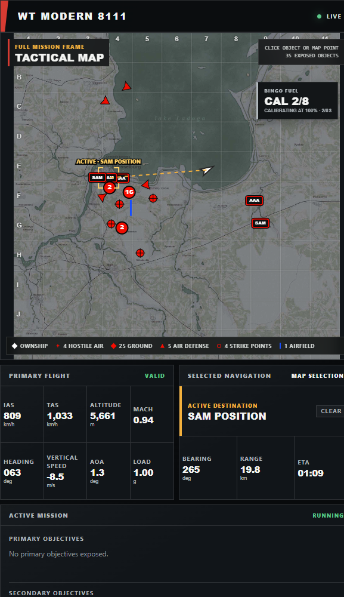
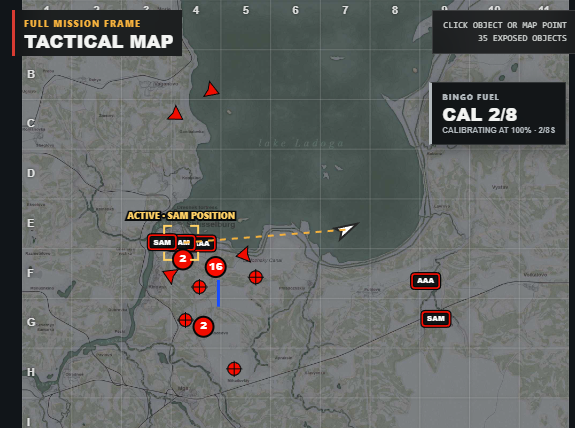

# WT Modern 8111

A local second-screen dashboard for War Thunder Simulator Battles.

WT Modern 8111 reads the telemetry and tactical-map data exposed at
`localhost:8111`, then presents it in a map-first interface for a second monitor,
laptop, or tablet. It does not modify, inject into, or read memory from the game.



## Features

- Live tactical map with player position, aircraft, ground units, airfields,
  objectives, and air defenses
- Clickable map objects and arbitrary navigation points
- Automatic detection of War Thunder map targets, including nearby-entity
  inference and tracking for moving targets
- Bearing, distance, and ETA to the active destination
- IAS, TAS, Mach, altitude, heading, vertical speed, AoA, and G-load
- Engine state, configuration, fuel quantity, and learned fuel consumption
- Direct-return bingo fuel estimate to the nearest friendly airfield
- Simulator radio support for `Guide on me`, `Cover me`,
  `Attention to the map`, and return-to-base calls
- Mission, chat, HUD-event, and damage feed
- Offline fixture mode for development without the game running



## Run from source

Requirements:

- Go 1.27 or later
- Node.js 24 or later

Build the embedded frontend:

```powershell
npm --prefix .\web ci
npm --prefix .\web run build
```

Run the companion while War Thunder is open:

```powershell
go run .\cmd\wt-modern
```

The dashboard opens at `http://127.0.0.1:17711`. Use `-open=false` to suppress
automatic browser launch.

Run with the included offline fixture:

```powershell
go run .\cmd\wt-modern -fixture .\docs\fixtures\air-test-flight-jh-7
```

## Development

```powershell
npm --prefix .\web run typecheck
npm --prefix .\web run lint
npm --prefix .\web test
npm --prefix .\web run build
go test .\...
```

The Go companion handles polling, normalization, local identity, and SSE
delivery. The React frontend is split into feature, navigation, map-rendering,
and shared UI modules. CI runs frontend validation, Go vet, race-enabled tests,
and a full companion build.

## Limitations

- Only information deliberately exposed by War Thunder's local HTTP API is used.
- Accurate AA range rings are not available because the API does not identify
  the specific air-defense vehicle or weapon.
- Simulator Battles are the current priority.
- There is not yet a packaged release or installer.

## Documentation

- [Architecture and implementation plan](PLAN.md)
- [localhost:8111 API research](docs/localhost-8111-api.md)
- [Live-capture protocol](docs/sim-live-capture.md)
